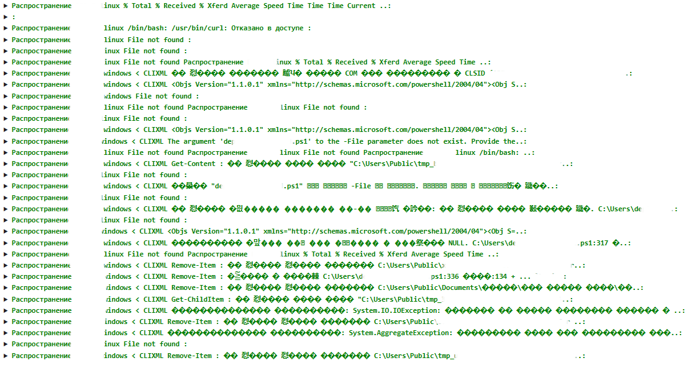
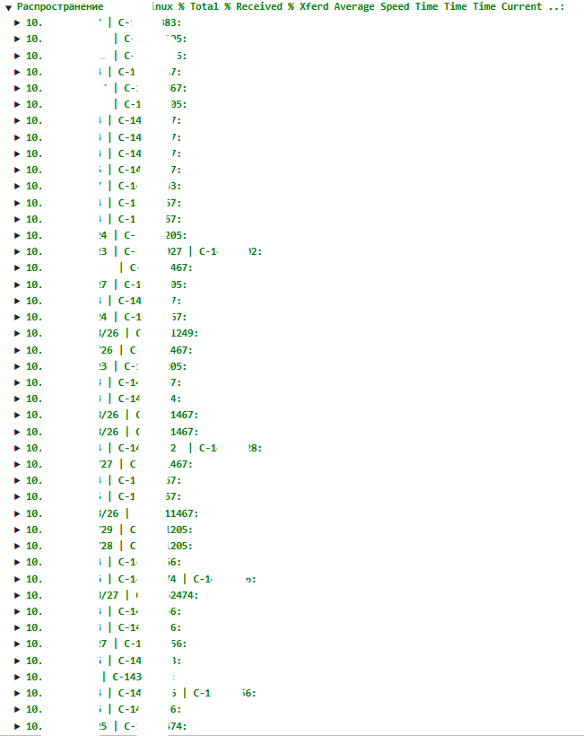
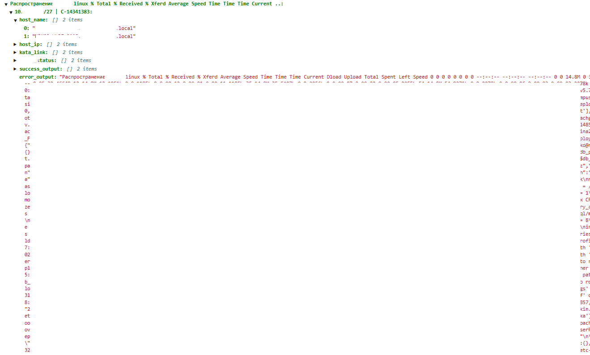
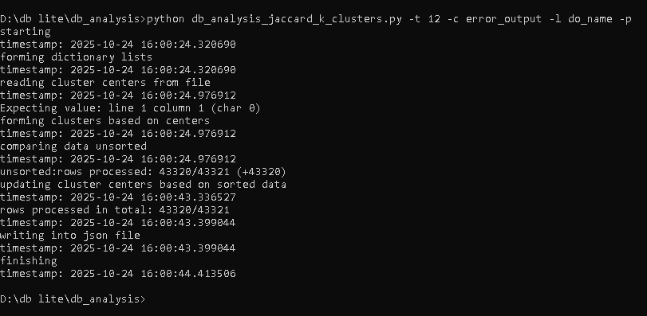
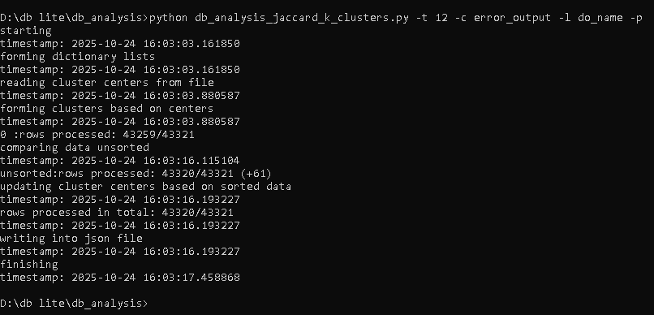
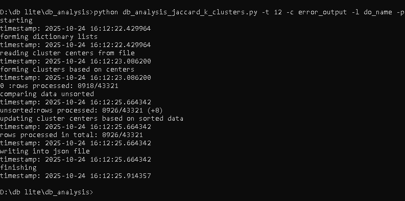
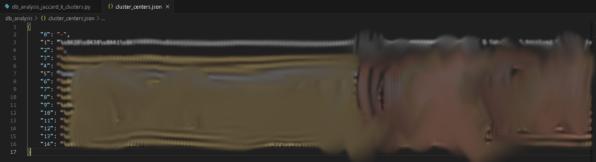
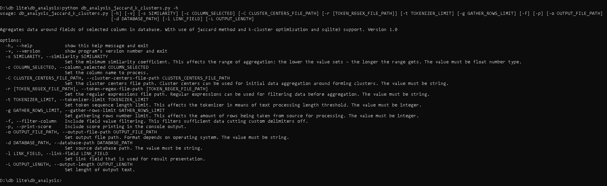

# DB анализ текстов на схожесть
## Назначение

Для удобства чтения больших журналов ошибок скрипт находит типовые записи и составляет <code>.json</code> отчет. Полезная информация в отчете: текст типовой записи, сгруппированные по подсетям и номерам обращений вложенные оригинальные тексты записей с именами и адресами хостов и ссылками.

Пример json отчета

  
Снимок экрана 1. JSON отчет, 1й уровень вложенности. 
 
  
Снимок экрана 2. JSON отчет, 2й уровень вложенности. 
 

Снимок экрана 3. JSON отчет, 3й уровень вложенности. 

## Описание

Скрипт делает запрос в базу данных. Затем он сравнивает полученные записи между собой на схожесть мерой Жаккара. Для этого каждая запись при проверке проходит процесс токенизации методом перевода SHA256 в целое число. Токены переводятся во множества (наборы только уникальных значений), и полученные множества сравниваются между собой мерой Жаккара (отношение пересечения двух множеств к их объединению). Результатом является коэффициент схожести.

Если коэффициент является ниже прописанного в скрипте значения порога (или заданного пользователем), то создается новый кластер с центром представленным как текст одной из двух сравниваемых ошибок, содержащий одну запись. Если же коэффициент превышает значение порога, то запись переносится в кластер к сравниваемой другой записи.

Для оптимизации процесса используется метод k-кластеризации. Скрипт может взять уже заранее готовые центры кластеров из <code>.json</code> файла. Также он добавляет в файл новые центры, если в ходе работы были созданы новые кластеры, центров которых еще нет в файле.

Таким образом, большие данные сравниваются сначала с центрами кластеров, а затем уже несортированные данные сравниваются между собой, что ускоряет работу скрипта. Добавление новых центров позволяет использовать скрипт на малых объемах данных, постепенно увеличивая объем, по мере того, как появляются новые центры на уже изученных скриптом данных, для экономии времени.

Скрипт сравнивает 43 тыс. записей от 10.0 до 15.0 сек. Оптимизация k-кластерами позволяет масштабировать обработку, без значительных потерь скорости.

Пример с 43 тыс записей

  
Снимок экрана 4. Обработка записей без кластеризации, с выводом счетчика в поток терминала. 
 

Снимок экрана 5. Обработка записей с кластеризацией на основании предыдущего результата. 
 

Снимок экрана 6. Остановка программы с сохранением прогресса. 
 

Снимок экрана 7. Файл содержащий центры кластеров. 
 

## Требования
Стандартные библиотеки:
- json
- struct
- re
- time
- datetime
- argparse
- hashlib

Кастомные библиотеки:
- sqlite3
- prettytable

Наличие базы данных в файле SQLite3. 
Версия Python >=11.

## Использование
- Найти пути до файла базы данных и центров кластеров (при наличии); стандартные пути соответствуют директории расположения скрипта.
- Запустить скрипт с интерпретатором Python; возможен запуск с параметрами (их можно посмотреть запустив скрипт с --help).

Пример вывода справки

  
Снимок экрана 8. Вывод справки. 

